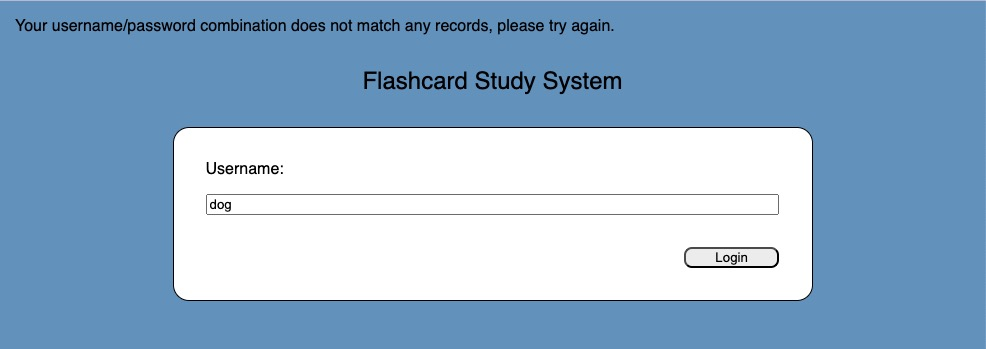
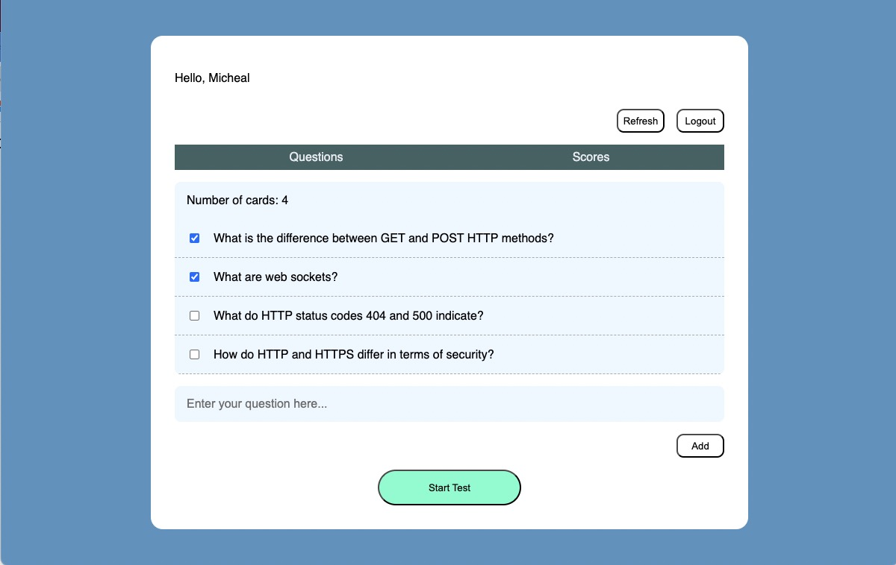
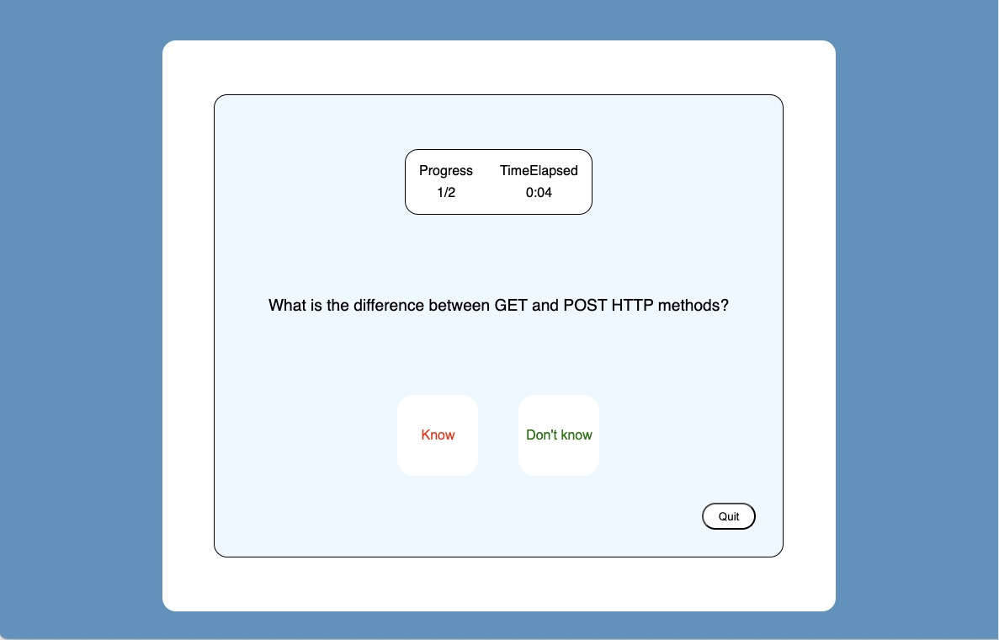
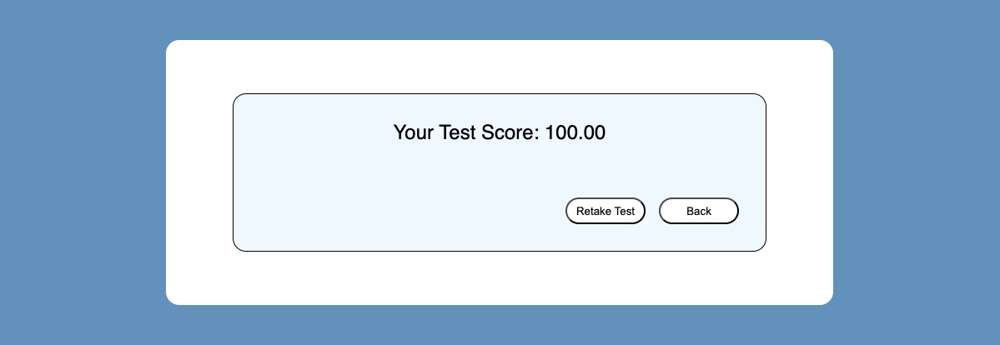
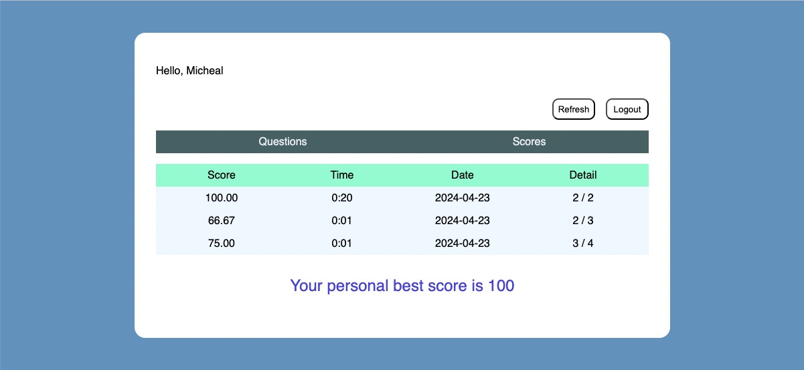

# Flashcard Study System

A "flashcard" study system where the user can manage collections of data and run through flashcards to test their knowledge, The user can mark whether they got each card right and the system will show their total score each time and their personal best score

## Some of the Screenshots of the Application

### Login Page

### Manage the question cards they want to test

### Begin Testing

### Get test result

### Check score records

## Backend

### Session Related APIs:

1. /api/v1/session :

    - `POST` : Authenticates or initializes a user session. Handles special case for "dog" user as lacking sufficient permissions.

    - `GET` : Retrieves the current session's user information.
    
    - `DELETE` : Ends and clears the user session.

### Test Cards Related APIs:
1. /api/v1/cards

    - `GET` : Retrieves all question cards for the current session.

    - `POST` : Adds a new question card to the user's collection.

2. /api/v1/cards/:id

    - `GET` :  Retrieves a specific question card by ID.

    - `PUT` : Updates the entire question card including question text and test inclusion.Checks if the question field in the request body is not empty before adding a new card.

    - `PETCH` : Partially updates a question card's properties.

    - `DELETE` : Removes a question card by ID.

3. /api/v1/cards/test

    - `GET` :  Retrieves a subset of question cards specifically marked for testing.
    
### Scores Related APIs:

1. /api/v1/scores

    - `GET` : Fetches all score records for the user.

    - `POST` : Logs a new score with associated details.

## Frontend

1. **Login and SignUp pages** : If the user is new, then user has to sign-up and enter the details. After that user needs to Login with the username.

1. **HomePage** : Has a Navigation bar, that routes the user to Questions Page(default), Scores Page

1. **Questions Page** : Displays all the question cards previously created by the user. Users can add new cards, edit existing ones, or delete them.

1. **Testing Page** : Users can start a testing session where they can interact with the flashcards to test their knowledge. Each card can be marked as 'known' or 'unknown', and the system calculates the score based on these interactions.

1. **Scores Page** : Shows a history of scores from previous tests, including details like the score percentage, time elapsed, the date of the test, and a breakdown of correct vs. incorrect answers. Users can also view their highest or 'best' score to date.
